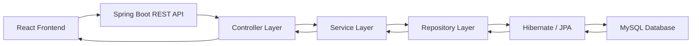
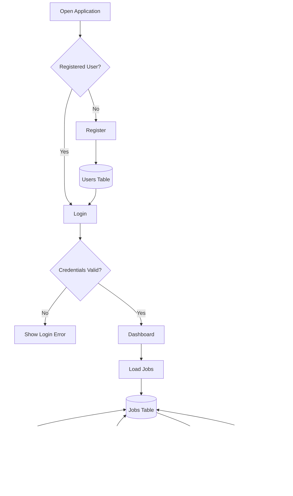
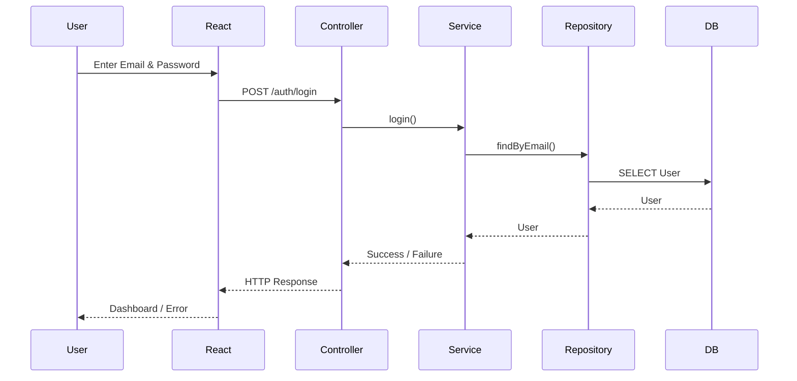
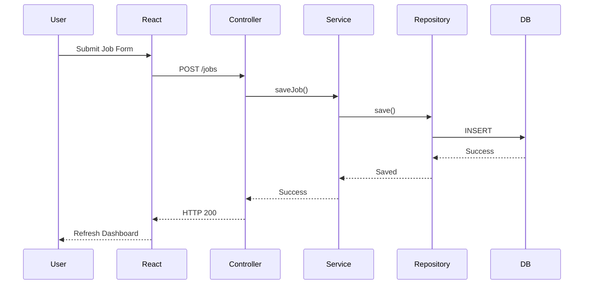
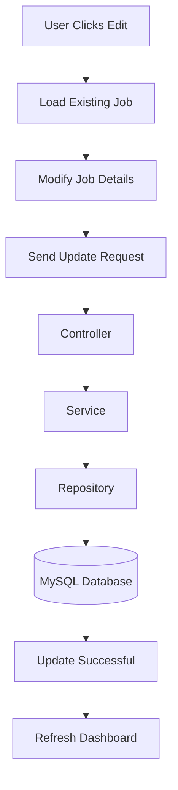
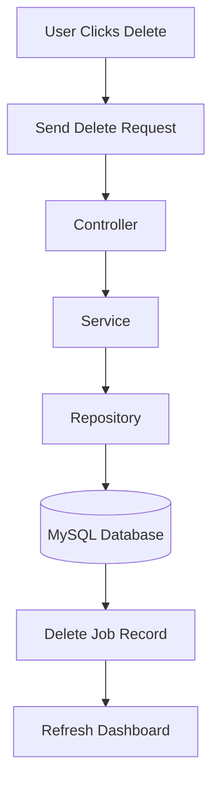
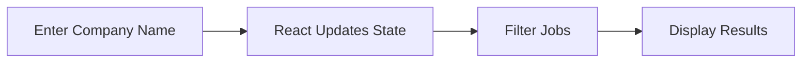
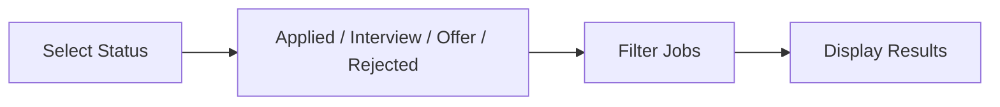
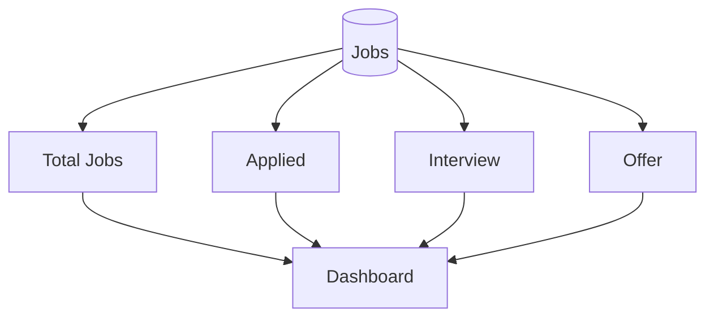
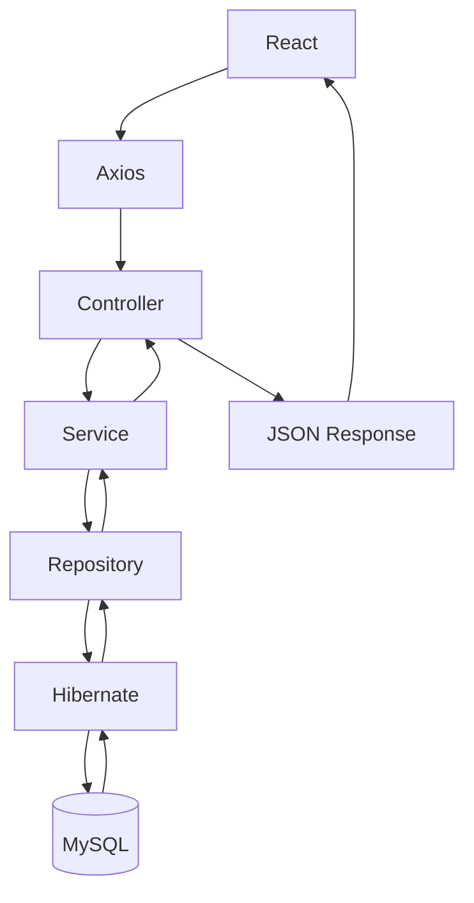

# Job Application Tracker

## Overview

Job Application Tracker is a full-stack web application built using
React.js, Spring Boot, and MySQL. It allows users to register, log in,
and manage their job applications by adding, editing, deleting,
searching, and filtering jobs.

------------------------------------------------------------------------

# Tech Stack

## Frontend

-   React.js
-   Vite
-   Axios
-   Bootstrap
-   React Router
-   React Toastify

## Backend

-   Java
-   Spring Boot
-   Spring Data JPA
-   Hibernate
-   Maven

## Database

-   MySQL

## Tools

-   Git
-   GitHub
-   IntelliJ IDEA
-   VS Code
-   Postman
-   Railway
-   Render

------------------------------------------------------------------------

## System Architecture



------------------------------------------------------------------------

# Complete Application Workflow



------------------------------------------------------------------------

# Login Flow



------------------------------------------------------------------------

# Add Job Flow



------------------------------------------------------------------------

## Edit Job Flow



------------------------------------------------------------------------

## Delete Job Flow


------------------------------------------------------------------------

# Search Flow



------------------------------------------------------------------------

# Filter Flow



------------------------------------------------------------------------

# Dashboard Statistics



------------------------------------------------------------------------

# Backend Request Lifecycle



------------------------------------------------------------------------

# Folder Structure

``` text
Frontend
src/
 ├── components
 ├── pages
 ├── App.jsx
 └── main.jsx

Backend
src/main/java
 ├── controller
 ├── service
 ├── repository
 ├── entity
 ├── security
 └── config
```

------------------------------------------------------------------------

# Database

## users

-   id
-   name
-   email
-   password

## jobs

-   id
-   companyName
-   jobTitle
-   location
-   status
-   appliedDate

------------------------------------------------------------------------

# REST APIs

  Method   Endpoint                Purpose
  -------- ----------------------- ----------------
  POST     /auth/register          Register
  POST     /auth/login             Login
  POST     /auth/forgot-password   Reset Password
  GET      /jobs                   Get Jobs
  POST     /jobs                   Add Job
  PUT      /jobs/{id}              Update Job
  DELETE   /jobs/{id}              Delete Job

------------------------------------------------------------------------

# Future Enhancements

-   JWT Authentication
-   BCrypt Password Encryption
-   Resume Upload
-   Email Notifications
-   Interview Reminders
-   Charts & Analytics
-   Role-Based Access Control

------------------------------------------------------------------------

# Author

**Navya Chandrika**
